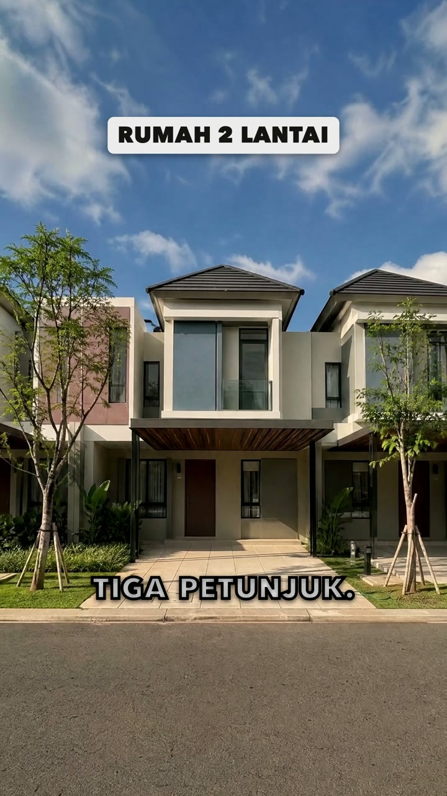

# Pelajaran 02 · Model Gambar, Video, Suara, dan Agent

## Tujuan

Setelah pelajaran ini, kamu bisa:

- menyebut lima model yang kita pakai dan tugas masing-masing;
- menjelaskan kenapa model gambar sering salah di teks, logo, dan jari;
- menjelaskan kenapa klip video kita pendek, dengan satu gerakan kamera;
- menjelaskan apa itu agent (otak, badan, dan uraian tugasnya), dan kenapa persetujuan tetap di tanganmu;
- membedakan tiga level memakai AI: konsultan, agent, dan orkestrator;
- menjelaskan apa itu kie.ai dan OpenRouter, dan berapa kira-kira biayanya.

## Kenapa ini penting

Kalau kamu tahu cara model bekerja, kamu tahu di mana ia biasanya salah dan apa yang harus dicek. Hampir setiap aturan di bagian praktik berasal dari sifat model yang kamu pelajari di sini.

## 1. Satu tim model, masing-masing satu keahlian

Kita tidak memakai satu AI, tapi lima *model*: program AI yang masing-masing dilatih untuk satu jenis hasil.

| Jenis | Model | Tugas di reel | Biaya |
|---|---|---|---|
| Teks | glm-5.3-flash (di workshop) atau Claude | merencanakan, menulis prompt, memeriksa hasil | dibayar terpisah, bukan dengan kredit kie.ai |
| Gambar | gpt-image-2 | style frame, lembar referensi, storyboard, frame pertama | 10 kredit per gambar 2K |
| Video | Veo 3.1 Lite | membuat gambar yang sudah disetujui bergerak | 35 kredit per klip 8 detik di 1080p (30 kredit di 720p) |
| Suara | Gemini TTS | narasi dari naskah | sekitar US$0,003 per take 20 detik |
| Musik | Lyria | musik latar dengan drop | sekitar US$0,04 per klip musik 30 detik |

Istilah di tabel itu:

- *Kredit*: satuan bayar di kie.ai (https://kie.ai), layanan tempat alat kita memanggil model gambar dan video. Suara dan musik dipanggil lewat OpenRouter (https://openrouter.ai), dibayar dalam dolar, hitungannya sen.
- *Shot*: satu potongan gambar dalam video. *Style frame*: gambar acuan tampilan seluruh reel. Lembar referensi: gambar acuan wajah atau tempat. *Storyboard*: gambar rencana tiap shot.
- *Take*: satu kali hasil. Minta ulang berarti take baru.
- *1080p* dan *720p*: ukuran ketajaman video. 1080p lebih tajam.
- *Drop*: momen saat musik tiba-tiba penuh setelah bagian yang tenang.

Satu klip video seharga tiga setengah gambar. Di reel contoh kita, semua gambar habis sekitar 70 kredit. Videonya 7 klip × 35 = 245 kredit. Suara dan musik kurang dari US$0,50. Karena itu urutannya selalu sama: teks, gambar, dan suara dulu. Video paling akhir.

Setelah alatnya terpasang di Pelajaran 04, kamu bisa melihat model gambar dan video yang dikenal alat kita:

```bash
python3 2_Tools/vg/vg.py models
```

`live-tested` artinya model itu sudah dicoba dengan pembayaran nyata.

## 2. Model gambar: dari bintik acak ke gambar

Gambaran sederhananya begini. Model gambar mulai dari *noise*, yaitu bintik-bintik acak seperti layar TV tanpa siaran. Dalam banyak langkah, ia membuang sedikit noise setiap kali, sampai gambarnya cocok dengan *prompt*, yaitu teks perintah yang kamu tulis. Ia memakai pola dari gambar yang ia lihat saat latihan.

Kata kuncinya: **masuk akal, bukan benar.** Model tidak tahu rumah klienmu. Ia hanya tahu seperti apa rumah pada umumnya. Akibatnya:

- **Teks dan logo sering kacau.** Model tidak mengeja. Ia menggambar bentuk yang *mirip* huruf.
- **Jari sering salah.** Jumlahnya bisa lebih, atau jarinya menyatu.
- **Detail bisa dikarang.** Jendela atau pintu bisa berbeda dari aslinya.

Maka aturan kita: gambar yang akan dijadikan video tidak berisi tulisan. Semua tulisan ditambahkan saat edit.



Tulisan "RUMAH 2 LANTAI" dan "TIGA PETUNJUK." di gambar ini ditambahkan saat edit, bukan oleh model gambar, jadi hurufnya pasti benar. Di proyek nyata, rumah yang dijual adalah foto asli dari klien, dan hanya kameranya yang bergerak. Di contoh kelas ini rumahnya gambar AI, karena klien dan proyeknya fiktif.

Model gambar juga bisa diberi gambar acuan (*reference image*), misalnya potret Rani, presenter kita yang dibuat AI dari nol. Dengan acuan, wajah Rani tetap sama di setiap shot.

## 3. Model video: menebak gambar berikutnya

Video adalah urutan *frame*, yaitu gambar diam yang diputar cepat. Reel kita berisi 30 frame per detik, jadi delapan detik berarti 240 gambar.

Semua gambar itu harus konsisten: rumah di frame ke-200 harus sama dengan di frame pertama. Kita memberi model *frame pertama* yang sudah disetujui, kadang juga frame terakhir, sebagai pegangan.

Yang paling sulit bagi model video:

- **tubuh yang bergerak**, misalnya orang berjalan;
- **bibir**, yang harus cocok dengan suara;
- **tangan**, karena bentuknya terus berubah;
- **klip panjang**: makin banyak frame, makin banyak kesempatan melenceng, dan benda bisa pelan-pelan berubah bentuk.

Karena itu, tiga aturan kita:

1. **Klip pendek.** Di reel ini, paling lama 8 detik.
2. **Satu gerakan kamera per klip.** Misalnya maju pelan ke pintu, lalu diam.
3. **Frame pertama dari gambar yang sudah disetujui.** Tampilannya sudah dicek sebelum ada biaya video.

Contoh prompt video. Isinya hanya gerakan, cahaya, suara sekitar, dan apa yang tidak boleh berubah:

```text
Slow push-in of about half a metre over 6 seconds toward the front door, eye height 1.5 m, verticals straight; eases out and holds. Bright afternoon sun from the left. AUDIO: quiet street, birds. Nobody speaks. LOCKS: the house stays exactly as in the first frame.
```

Soal bibir, kami belajar dengan cara yang sulit. Di versi pertama reel ini, suara TTS ditempel di atas bibir buatan AI, dan suara ruangannya dimatikan sampai hening. Hasilnya terasa seperti dubbing yang buruk. Sekarang narasi berupa *voice-over* (suara narator di atas gambar), dan orang di klip menutup mulut.

## 4. Model suara dan musik

**Gemini TTS** adalah model *text-to-speech* (TTS), pengubah teks menjadi suara. Ia membaca teks persis seperti tertulis. Karena itu naskah narasi menulis angka seperti diucapkan, "mulai satu koma tiga M-an", sementara teks di layar (*caption*) menulis "1,3M-AN". Suara narasi reel ini bernama Callirrhoe. Pilih suara dengan telinga, bukan dengan skor.

**Lyria** membuat musik dari deskripsi teks. Prompt musiknya menjelaskan susunan: tenang di bawah suara narator, naik, hening sebentar, lalu drop. Di reel contoh, drop itu jatuh tepat saat harga disebut.

## 5. Agent: AI yang bisa memakai alat

*Chatbot* biasa hanya menjawab dengan teks. *Agent* adalah model bahasa yang diberi alat: ia bisa membaca file, menjalankan perintah, dan melihat hasilnya. Ia bekerja dalam putaran:

1. **Rencanakan**: baca brief dan skill.
2. **Kerjakan**: jalankan alat vg.
3. **Periksa**: lihat hasilnya.
4. **Perbaiki**: ulangi yang kurang.

Sebuah agent punya tiga bagian:

| Bagian | Ibaratnya | Di workshop |
|---|---|---|
| Model bahasa | otak: berpikir dan memutuskan langkah | glm-5.3-flash, model yang cepat dan murah |
| Aplikasi agent | badan: membuka file, menjalankan perintah, dan mengobrol denganmu | WorkBuddy, aplikasi desktop dari Tencent |
| *Expert* | uraian tugas (*job description*): pekerjaan apa yang dikerjakan, dan aturan apa yang tidak boleh dilanggar | Expert AI Videographer |

Claude Code juga bisa dipakai. Di sana otaknya model Claude, badannya aplikasi Claude Code, dan uraian tugasnya dibaca dari file `AGENTS.md` di folder kelas.

Agent mana pun yang kamu pakai, ia menjalankan alat yang sama: vg, program Python di folder `2_Tools/vg/`, yang memanggil model, mencatat biaya, dan menolak membuat video yang belum kamu setujui. Ia juga membaca *skill* yang sama, yaitu file instruksi di folder `1_Skills/`. Skill menjelaskan cara kerja kita tahap demi tahap, seperti SOP (prosedur standar) di kantor. Titik mulainya `1_Skills/vg-director/SKILL.md`.

Kenapa model kecil seperti glm-5.3-flash cukup? Karena Expert-nya tidak perlu mengingat seluruh alur. Sebelum setiap langkah, ia bertanya ke alat dengan `vg next`, dan alat menjawab dengan satu langkah berikutnya (Pelajaran 05).

Contoh satu putaran di tahap Look: agent menjalankan perintah gambar (`python3 2_Tools/vg/vg.py image`) untuk membuat style frame, lalu melihat setiap gambar. Ada tulisan aneh di dinding, atau matahari dari arah yang salah? Ia membuat take baru. Setelah itu ia menunjukkan hasilnya di halaman review, dan menunggu kamu bilang setuju.

Kamu cukup bicara ke agent dengan bahasa biasa, misalnya: "Buat reel dari brief di 5_Projects/.../0_Source".

Tapi agent juga model bahasa. Ia bisa salah, bahkan salah dengan yakin. Karena itu tiga gerbang persetujuan tetap di tanganmu. Di kelas ini, di setiap gerbang kamu sendiri yang mengklik tombol setuju di halaman review. Perintah persetujuan dari *terminal* (layar tempat mengetik perintah) selalu ditolak, jadi agent tidak bisa menyetujui untukmu.

## 6. Tiga level AI: konsultan, agent, orkestrator

Cara kita memakai AI bisa dibagi tiga level. Makin tinggi levelnya, makin sedikit kamu mengetik, dan makin penting keputusanmu.

| Level | AI berperan sebagai | Kamu berperan sebagai | Contoh di dunia video |
|---|---|---|---|
| 1 · Konsultan | penasihat: kamu bertanya, ia menjawab dengan teks | pekerja: menyalin, menempel, dan mengerjakan sendiri | kamu minta chatbot menulis naskah reel 25 detik, lalu membuat gambar dan videonya sendiri di aplikasi lain |
| 2 · AI Agent | pekerja: memakai alat dan mengerjakan langkah demi langkah | manajer: memberi brief, memeriksa, dan menyetujui | kelas ini: Expert AI Videographer menulis rencana, membuat gambar dan video lewat vg, lalu berhenti di tiga gerbang |
| 3 · Orkestrator | kepala produksi: membagi pekerjaan ke beberapa agent sekaligus, lalu memeriksa hasil mereka | pemilik: menetapkan tujuan, standar, dan anggaran | satu AI menyuruh satu agent menulis naskah, satu membuat gambar, dan satu memeriksa kualitas, bersamaan |

Kelas ini ada di **Level 2**. Kamu akan merasakan sendiri: agent yang mengerjakan hampir semuanya, kamu yang memutuskan. Materi kelas ini sendiri disusun di Level 3: beberapa agent menulis dan memeriksa bagian yang berbeda secara bersamaan, lalu hasilnya digabung dan diperiksa lagi.

Satu hal tidak berubah di level mana pun: keputusan dan tanggung jawab tetap di manusia. Makin banyak yang dikerjakan AI, makin penting gerbang persetujuanmu.

## 7. kie.ai dan OpenRouter: tempat model tinggal

Model gambar, video, dan suara tidak berjalan di laptopmu. Mereka berjalan di server pembuatnya: Google, OpenAI, Kuaishou, dan lainnya. Alat vg memanggil mereka lewat dua layanan perantara.

Bayangkan aplikasi pesan-antar makanan: satu aplikasi, satu dompet, banyak restoran. kie.ai dan OpenRouter bekerja seperti itu untuk model AI. Kamu tidak perlu membuat akun di setiap perusahaan AI. Cukup satu akun dan satu kunci untuk masing-masing.

| | kie.ai | OpenRouter |
|---|---|---|
| Isinya | lebih dari 100 model gambar, video, dan musik | lebih dari 400 model teks dan suara |
| Yang kita pakai | gpt-image-2 (gambar), Veo 3.1 Lite dan Kling (video) | Gemini TTS (narasi) dan Lyria (musik) |
| Cara bayar | isi saldo kredit dulu, kreditnya tidak hangus | isi saldo dolar, dipotong per pemakaian |
| Contoh biaya | 1 kredit sekitar US$0,005 (± Rp80). Satu gambar 10 kredit (± Rp800), satu klip video 8 detik 35 kredit (± Rp2.900) | satu take narasi 20 detik sekitar US$0,003 (± Rp50) |
| Kuncinya | `KIE_API_KEY` | `OPENROUTER_API_KEY` |

Hitungan rupiah memakai kurs sekitar Rp16.000 per dolar.

Kenapa lewat perantara, bukan langsung ke Google atau OpenAI? Satu akun untuk banyak model, satu tempat mengisi saldo, dan harganya sering lebih murah daripada harga resmi. Kekurangannya: kita bergantung pada layanan perantara. Kalau layanannya sedang sibuk atau gangguan, pembuatan gambar atau video ikut tertunda. Karena itu alat vg mencatat setiap pesanan, dan `vg resume` bisa mengambil hasil yang tertunda nanti, tanpa membayar dua kali.

Otak agent (glm-5.3-flash) tidak lewat keduanya. Ia dibayar dengan kredit WorkBuddy.

## Latihan kecil

Pasangkan setiap tugas dengan modelnya: model teks (glm-5.3-flash atau Claude), gpt-image-2, Veo 3.1 Lite, Gemini TTS, atau Lyria.

1. Membuat potret referensi Rani.
2. Membaca "Tebak harga rumah ini." dengan suara Callirrhoe.
3. Menulis shot list dari brief.
4. Membuat kamera maju pelan ke pintu rumah.
5. Membuat musik yang drop saat harga disebut.
6. Memeriksa apakah ada tulisan aneh di style frame.

Lalu jawab: tugas mana yang paling mahal, dan kenapa ia dikerjakan paling akhir?

<details>
<summary>Jawaban latihan</summary>

1 gpt-image-2 · 2 Gemini TTS · 3 model teks · 4 Veo 3.1 Lite · 5 Lyria · 6 model teks sebagai otak agent, lalu kamu ikut mengecek.

Yang paling mahal nomor 4, video: 35 kredit per klip. Ia paling akhir karena memperbaiki gambar jauh lebih murah daripada memperbaiki video.

</details>

## Cek pemahaman

1. Kenapa tulisan di papan nama sering kacau kalau dibuat model gambar?
2. Sebutkan tiga aturan yang membuat klip video kita lebih stabil.
3. Apa bedanya chatbot dan agent?
4. Kamu minta chatbot menulis naskah, lalu kamu membuat gambarnya sendiri di aplikasi lain. Itu level berapa? Kalau di kelas ini, level berapa?
5. Apa bedanya kie.ai dan OpenRouter?

<details>
<summary>Jawaban</summary>

1. Model gambar menggambar yang paling masuk akal, bukan yang benar. Ia tidak mengeja; ia menggambar bentuk yang mirip huruf. Karena itu tulisan ditambahkan saat edit.
2. Klip pendek, satu gerakan kamera per klip, dan frame pertama dari gambar yang sudah disetujui.
3. Chatbot hanya menjawab dengan teks. Agent memakai alat dalam putaran rencanakan, kerjakan, periksa, perbaiki. Agent tetap bisa salah, jadi persetujuan di tangan manusia.
4. Level 1: AI jadi konsultan, kamu yang mengerjakan. Di kelas ini Level 2: agent yang mengerjakan, kamu memutuskan.
5. Keduanya perantara: satu akun untuk banyak model. kie.ai untuk gambar, video, dan musik, dibayar dengan kredit. OpenRouter untuk teks dan suara, dibayar dalam dolar per pemakaian.

</details>

## Ringkasan

- Tim kita: glm-5.3-flash atau Claude (teks), gpt-image-2 (gambar), Veo 3.1 Lite (video), Gemini TTS (suara), dan Lyria (musik). Video paling mahal, jadi dibuat paling akhir.
- Model gambar menggambar yang masuk akal, bukan yang benar. Teks, logo, dan jari selalu dicek; tulisan ditambahkan saat edit.
- Model video harus menjaga ratusan frame tetap konsisten. Maka: klip pendek, satu gerakan kamera, frame pertama yang sudah disetujui.
- Agent adalah model bahasa dengan alat, bekerja dalam putaran. Otaknya model (di workshop: glm-5.3-flash), badannya aplikasi agent (WorkBuddy atau Claude Code), dan uraian tugasnya Expert AI Videographer.
- Agent bisa salah, jadi gerbang tetap di tanganmu: kamu yang mengklik setuju di halaman review.
- Tiga level AI: konsultan (kamu yang mengerjakan), agent (AI yang mengerjakan, kamu memutuskan), orkestrator (AI membagi kerja ke banyak agent). Kelas ini Level 2.
- kie.ai dan OpenRouter adalah perantara: satu akun dan satu kunci untuk banyak model. Gambar sekitar Rp800, klip video sekitar Rp2.900.

Berikutnya: [Pelajaran 03 · Cara Berpikir dengan AI: Prompt, Batas, dan Etika](Pelajaran_03_Cara_Berpikir_Dengan_AI_v1.1.md)
