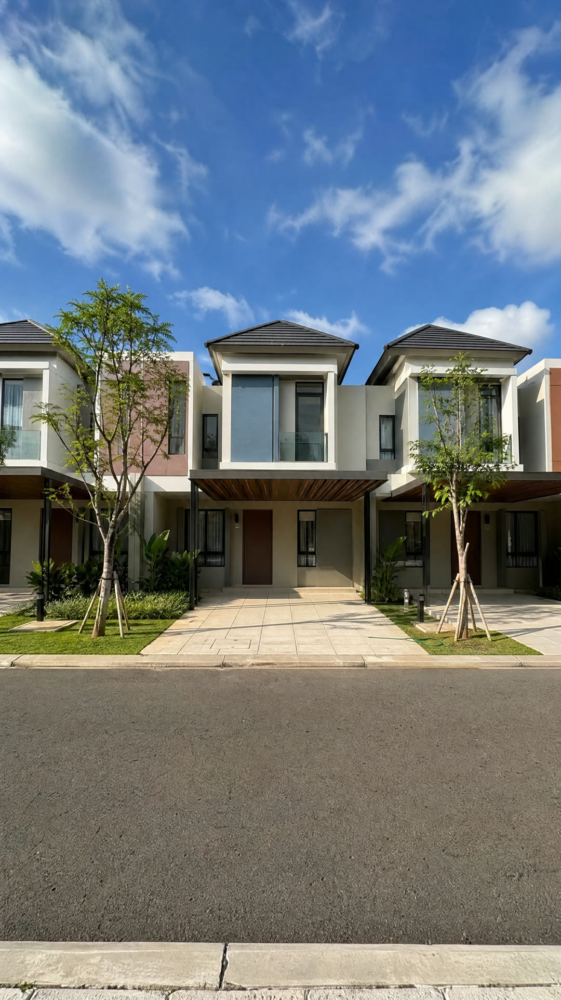
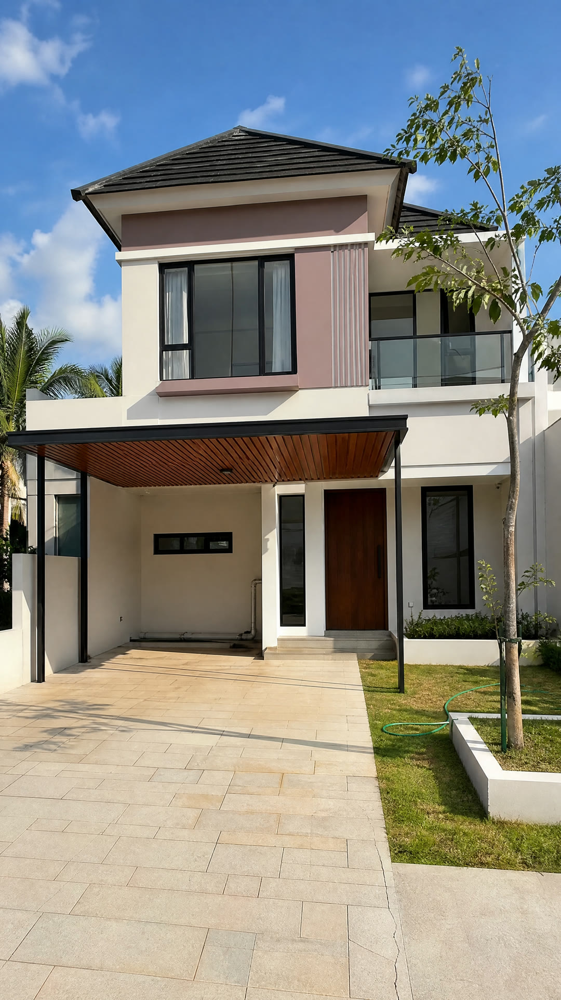

# Pelajaran 07 · Look: Satu Dunia Visual, dan Halaman Review

## Tujuan

Setelah pelajaran ini kamu bisa:

- menjelaskan kenapa satu *look* untuk seluruh reel lebih penting daripada gambar yang bagus satu per satu;
- membaca blok look: world, light, grade, graphics, dan style frame;
- memakai halaman review: memilih take, menulis catatan, dan menyetujui look;
- tahu apa yang ditolak alat sebelum Gerbang 1 terbuka.

## Kenapa ini penting

Reel pertama kami gagal, padahal setiap gambarnya lolos pemeriksaan. Masalahnya: gambar dicek satu per satu, dan tidak ada yang melihat reelnya utuh. Hasilnya, dalam satu reel ada enam waktu yang berbeda dalam sehari, dengan olahan warna yang berbeda pula. Setiap shot punya cahaya dan warnanya sendiri. Reel seperti itu langsung terasa seperti tempelan gambar AI.

Aturannya sekarang: look ditulis sekali, lalu disetujui manusia sebelum gambar lain dibuat.

## Apa itu look

*Look* adalah satu arah visual untuk seluruh reel. Agent menulisnya di blok `look` di `1_Script/Shotlist.json`, saat menyusun shot list (Pelajaran 06). Isinya empat baris dan beberapa gambar contoh.

| Baris | Artinya | Di reel contoh |
|---|---|---|
| `world` | satu tempat, satu waktu | Kota Harapan, satu sore hari kerja yang cerah, sekitar pukul setengah empat |
| `light` | arah dan sifat cahaya | matahari hangat dari kiri kamera, langit biru berawan tipis, bayangan pendek dan lembut |
| `grade` | olahan warna, dan yang dilarang | alami, bersih, hangat; tanpa *teal-orange* (olahan biru-oranye khas film), tanpa *golden hour* (cahaya keemasan menjelang matahari terbenam), tanpa senja |
| `graphics` | gaya teks dan grafis | satu font tebal, warna aksen oranye #FF5A1F, caption di sepertiga bawah, tidak pernah menutupi wajah, tidak ada apa pun di 10% atas dan bawah layar |

Di file aslinya, agent menulis look dalam bahasa Inggris, karena model paling paham bahasa itu. Potongannya (diringkas):

```json
"look": {
  "light": "Bright, warm mid-afternoon sun from camera left under a clear blue sky with soft clouds, short soft shadows.",
  "grade": "Naturalistic, clean and warm ... No teal-orange, no golden-hour glow, no dusk.",
  "style_frames": [ { "id": "Look_Rumah_Deret" }, { "id": "Look_Rumah_Depan" } ]
}
```

Satu dunia berlaku juga untuk gambar yang "beda". Rencana stasiun MRT di S07 dibuat di sore yang sama, dengan cahaya yang sama, dan diberi label ILUSTRASI RENCANA.

## Style frame: 2–3 gambar kunci

*Style frame* adalah gambar contoh yang menunjukkan look seluruh reel. Ia bukan shot final, tapi acuan. Misalnya satu gambar tempatnya tanpa orang, dan satu gambar presenter di dunia itu. Reel contoh memakai dua gambar tanpa orang: deretan rumah yang dijual, dan depan satu rumah untuk jawaban harga.




Rumah ini dibuat AI karena klien dan proyeknya fiktif. Di proyek nyata, rumah yang dijual adalah foto asli dari klien (Pelajaran 08).

Prompt lengkap `Look_Rumah_Depan` ada di Pelajaran 03. Perhatikan satu hal kecil: prompt itu sengaja meminta sedikit ketidaksempurnaan, yaitu selang di rumput dan retak kecil di paving. Cari keduanya di gambar. Detail seperti itu membuat gambar terasa seperti foto, bukan *render* (gambar 3D yang terlalu mulus).

Agent membuat style frame dengan perintah ini:

```bash
python3 2_Tools/vg/vg.py image -p NAMA_PROYEK --stage look
```

Ganti `NAMA_PROYEK` dengan nama folder proyekmu di `5_Projects/`. Gambar tidak butuh persetujuan: 10 kredit per gambar 2K, jadi dua style frame sekitar 20 kredit. Agent melihat setiap gambar dulu sebelum menunjukkannya kepadamu.

Pertanyaanmu hanya satu: **apakah ini look seluruh reel?** Cara mengeceknya:

- Matahari dari satu arah? Lihat arah bayangan.
- Jam yang sama di semua style frame?
- Warnanya sama? Tidak ada yang terlalu kuning atau terlalu biru?
- Tidak ada tulisan, logo, atau papan nama aneh?
- Terasa seperti foto, bukan render?

## Halaman review

Halaman review adalah halaman web yang berjalan di komputermu sendiri, bukan di internet. Biasanya agent yang membukanya. Kamu juga bisa membukanya sendiri:

```bash
python3 2_Tools/vg/vg.py review -p NAMA_PROYEK
```

Browser terbuka. Tulisan di halaman itu berbahasa Inggris. Isinya dari atas ke bawah:

1. Status dua gerbang (look dan reel) dan *approval mode* (cara persetujuan).
2. **Look**: teks world, light, grade, dan graphics, lalu satu kartu per style frame.
3. **Reference sheets**: lembar referensi karakter dan tempat (Pelajaran 08).
4. **Reel**: setiap beat, dan nanti animatic-nya (Pelajaran 10).

Di setiap kartu ada dua alat:

- **Take**: tombol `v1`, `v2`, dan seterusnya. *Take* adalah satu hasil dari satu kali pembuatan. Klik untuk memilih take yang dipakai tahap berikutnya.
- **Kotak catatan** bertulisan *What should change?* (apa yang harus diubah?), lalu tombol *Save note*. Kotak kosong berarti gambarnya sudah oke.

Tulis catatan yang spesifik, satu perubahan per catatan (ingat prinsip "satu perubahan sekali coba" di Pelajaran 03):

- Lemah: "kurang bagus".
- Kuat: "Bayangan jatuh ke kiri, jadi matahari dari kanan. Harus dari kiri, seperti Look_Rumah_Deret."

Setelah selesai, klik **Done, back to the agent**. Agent menerima ringkasan: baris `GATE` (status gerbang), `NOTE` (catatanmu), dan `NEXT` (langkah berikutnya). Ia memperbaiki hanya yang kamu catat, lalu membuka halaman lagi. Ulangi sampai kamu puas.

Halaman ini milikmu. Agent tidak boleh mengklik tombolnya atau menyetujui atas namamu.

## Gerbang 1: menyetujui look

Kalau kamu setuju, bilang ke agent di chat: "approved". Dengan pengaturan bawaan, halaman review tidak menampilkan tombol setuju. Di tempatnya ada tulisan *Approval mode is terminal* dan perintah lengkap untuk disalin. Intinya:

```bash
python3 2_Tools/vg/vg.py approve look -p NAMA_PROYEK
```

Jalankan perintah itu di Terminal-mu sendiri, persis seperti yang ditampilkan halaman. Alat menampilkan style frame yang akan disetujui, lalu memintamu mengetik kode acak 4 digit. Ketik kodenya, tekan Enter, lalu klik *Refresh* di halaman review.

Kenapa tidak cukup satu klik? Klik bisa dilakukan siapa saja, termasuk agent. Kode di terminalmu membuktikan manusia yang menyetujui. Agent tidak bisa mengetik kode ini, dan jangan pernah memintanya.

## Yang ditolak sebelum look disetujui

- **Semua panel storyboard dan frame.** Alat menjawab `REFUSED` dengan alasan *look not approved*, sebelum ada kredit terpakai.
- **Persetujuan look itu sendiri**, kalau masih ada style frame yang belum dibuat.

Setelah look disetujui:

- Style frame otomatis ikut jadi acuan setiap panel storyboard, frame pertama dan terakhir, serta lembar tempat atau produk. Lembar karakter tidak, supaya acuan wajah tetap netral. Grafis datar seperti peta bisa dikecualikan dengan `"look_refs": false`.
- Mengganti style frame, memilih take lain, atau mengubah teks look membatalkan persetujuan look. Persetujuan reel ikut batal. Kamu harus melihat dan menyetujui lagi.

Status kedua gerbang bisa dilihat kapan saja:

```bash
python3 2_Tools/vg/vg.py status -p NAMA_PROYEK
```

## Latihan kecil

Bayangkan reel tentang tempat yang kamu kenal, misalnya rumah keluargamu atau toko di dekat rumah. Tulis blok look-nya dalam bahasa biasa: satu kalimat untuk world, light, grade, dan graphics. Lalu uji: bisakah semua shot di reel itu hidup di satu jam dan satu cahaya yang sama? Kalau ada satu shot yang harus beda (misalnya rencana bangunan), tulis bagaimana kamu memberinya label.

## Cek pemahaman

1. Kenapa reel pertama kami gagal, padahal setiap gambar lolos pemeriksaan?
2. Kamu mencari tombol setuju di halaman review, tapi yang ada hanya sebuah perintah. Kenapa, dan apa yang kamu lakukan?
3. Look sudah disetujui. Lalu kamu memilih take `v2` untuk salah satu style frame. Apa yang terjadi?

<details>
<summary>Jawaban</summary>

1. Gambar dicek satu per satu, tanpa look bersama. Reelnya bercampur enam waktu yang berbeda dalam sehari, masing-masing dengan olahan warnanya sendiri. Masalah itu baru terlihat saat reel ditonton utuh.
2. Pengaturan bawaannya mode terminal: sebuah klik tidak membuktikan bahwa manusia yang menyetujui. Jalankan perintah itu di Terminal-mu sendiri, ketik kode 4 digit, tekan Enter, lalu klik Refresh.
3. Persetujuan look batal, dan persetujuan reel ikut batal. Kamu melihat look-nya lagi dan menyetujuinya lagi.

</details>

## Ringkasan

- Satu reel, satu look: satu dunia, satu cahaya, satu grade, satu gaya grafis.
- 2–3 style frame menunjukkan look itu. Gambar murah, jadi perbaiki sampai benar.
- Di halaman review kamu memilih take, menulis catatan spesifik, lalu klik Done.
- Gerbang 1: kamu sendiri yang menjalankan `approve look` dan mengetik kodenya.
- Sebelum look disetujui, alat menolak semua panel storyboard dan frame.

Berikutnya: [Pelajaran 08 · Karakter, Storyboard, dan Frame](Pelajaran_08_Karakter_Storyboard_Frame_v1.0.md)
