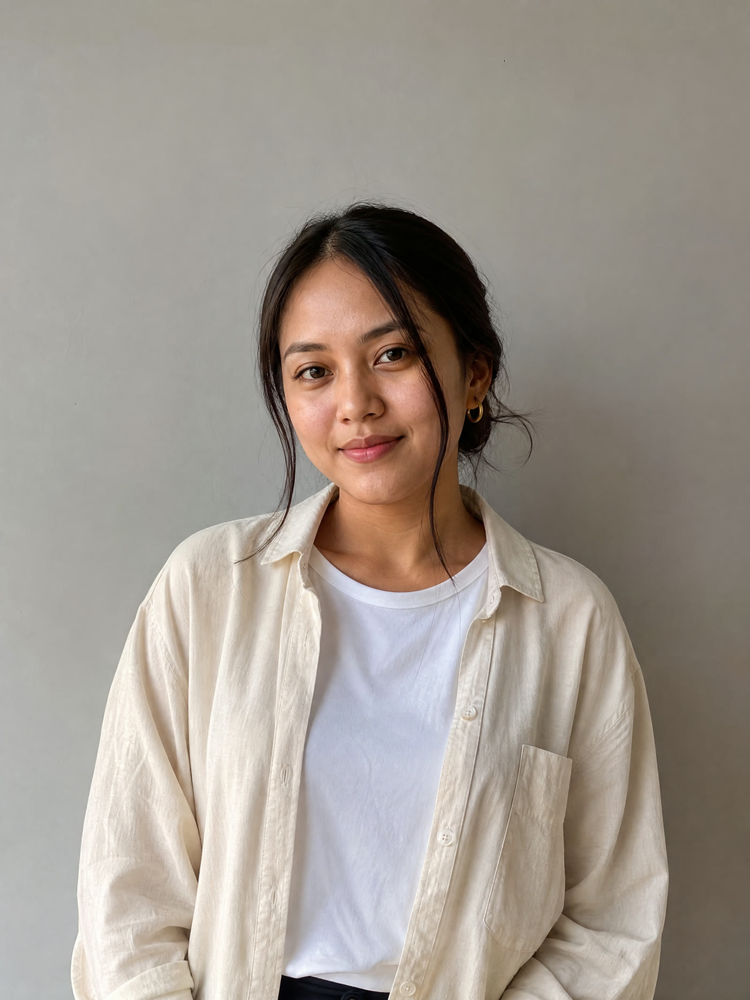
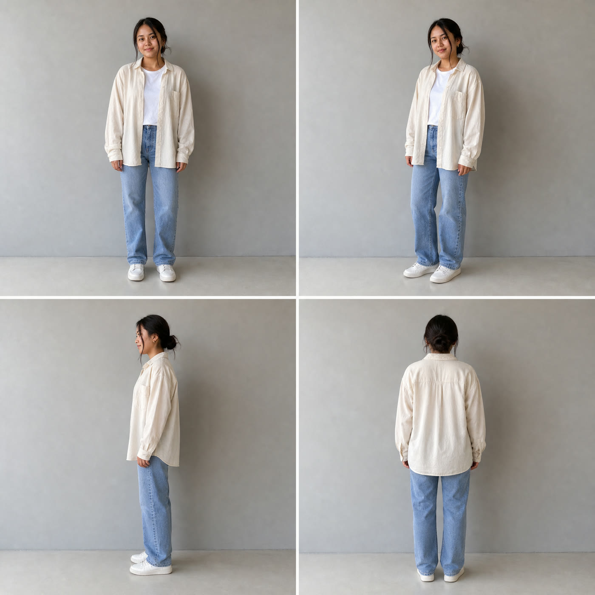
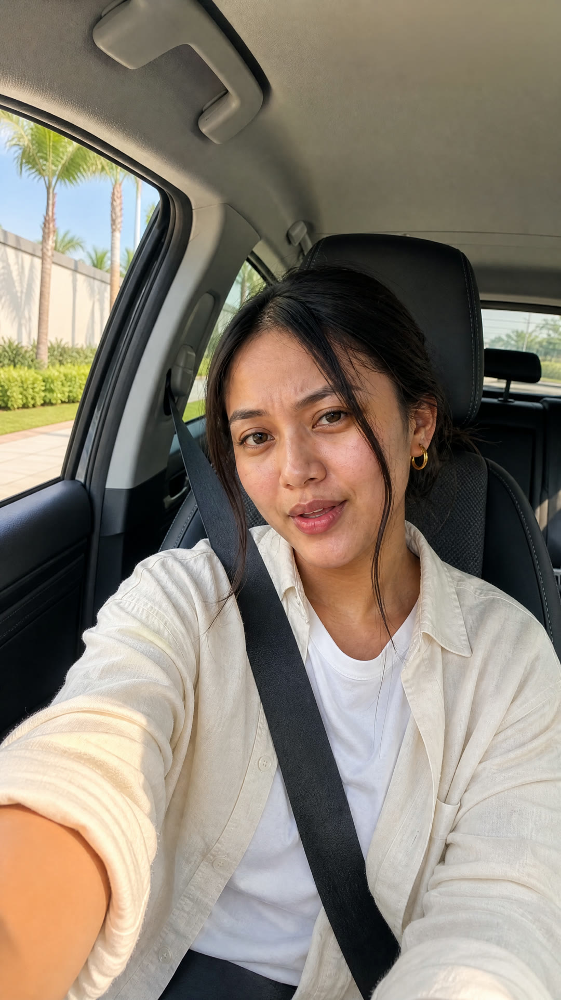
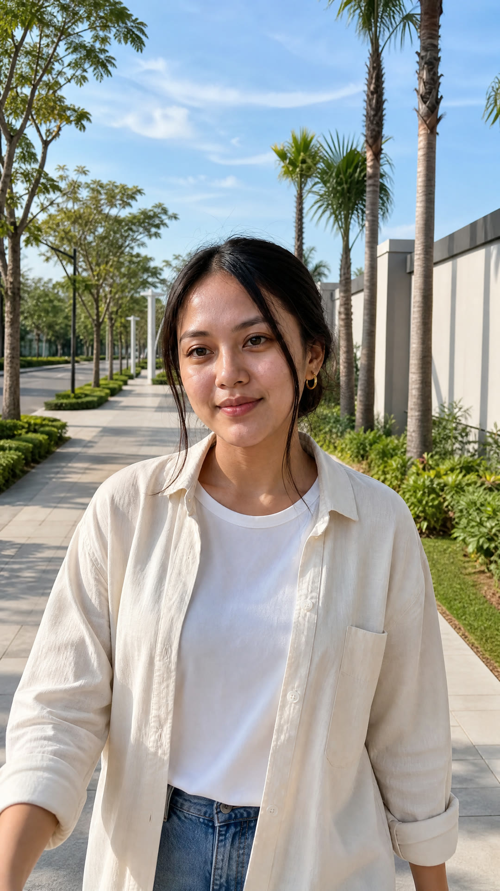

# Pelajaran 08 · Karakter, Storyboard, dan Frame

## Tujuan

Setelah pelajaran ini kamu bisa:

- menjelaskan kenapa presenter butuh lembar referensi (potret dan lembar putar) supaya wajahnya sama di setiap shot;
- menilai panel storyboard: apakah ia dibingkai di awal aksi;
- membedakan frame pertama dan frame terakhir, dan tahu kapan frame terakhir perlu dibuat;
- menjelaskan kenapa rumah yang dijual selalu foto asli klien, dan memeriksa kesinambungan antar shot.

## Kenapa ini penting

Model video menebak gambar berikutnya dari frame pertama yang kita berikan (Pelajaran 02). Jadi frame menentukan video. Gambar dengan cahaya salah, wajah seperti plastik, atau detail karangan akan menjadi klip yang buruk. Tidak ada prompt video yang bisa menyelamatkannya.

Memperbaiki gambar itu murah dan cepat. Memperbaiki video itu mahal dan lambat. Karena itu, di tahap ini semuanya masih gambar: lembar referensi, lalu panel storyboard, lalu frame pertama dan terakhir. Belum ada video.

## Bagian 1 · Wajah yang sama: lembar referensi

AI menggambar ulang wajah setiap kali. Tanpa acuan, Rani di S01 dan Rani di S06 bisa terlihat seperti dua orang berbeda. Solusinya adalah *reference sheet* (lembar referensi): gambar acuan yang dibuat sekali, lalu dipakai berulang.

Rani adalah presenter yang dibuat AI dari nol, bukan dari foto orang asli. Wajah orang asli hanya boleh dipakai dengan izin orangnya.

Rani punya dua lembar:

1. **Potret referensi** (*portrait*): setengah badan, menghadap kamera, latar abu-abu polos, cahaya rata. Ini jangkar identitasnya.
2. **Lembar putar** (*turnaround*): satu gambar berisi empat panel, yaitu depan, tiga perempat, samping, dan belakang. Lembar ini dibuat dari potret dengan cara *image-to-image*: gambar baru dibuat dengan gambar lain sebagai acuan.




Aturan membuat lembar:

- **Semua lembar turunan dibuat dari potret**, bukan dari lembar turunan lain. Setiap lompatan menambah pergeseran wajah.
- **Latar polos, cahaya rata.** Bayangan atau cahaya dramatis di lembar ikut terbawa ke semua shot.
- **Secukupnya.** Tiga atau empat tampilan sudah cukup. Setiap gambar tambahan adalah peluang baru untuk bergeser.

Agent membuat semua lembar yang belum ada, potret lebih dulu:

```bash
python3 2_Tools/vg/vg.py image -p NAMA_PROYEK --stage refs
```

Ganti `NAMA_PROYEK` dengan nama folder proyekmu di `5_Projects/`. Agent lalu melihat setiap lembar: wajahnya sama dengan potret? Jarinya normal? Ada tulisan aneh? Pakaiannya sama? Kulitnya tidak terlalu mulus seperti plastik?

Kalau satu lembar meleset, agent membuat take baru tanpa menimpa yang lama, lalu memilih take yang dipakai. Misalnya untuk lembar putar Rani:

```bash
python3 2_Tools/vg/vg.py image -p NAMA_PROYEK --target asset:Char_Rani_Turnaround --new-take
python3 2_Tools/vg/vg.py select -p NAMA_PROYEK --target asset:Char_Rani_Turnaround --version 2
```

Di halaman review (Pelajaran 07), kamu melakukan hal yang sama dengan tombol take, dan menulis catatan kalau ada yang harus diubah.

## Bagian 2 · Panel storyboard: bingkai di awal aksi

*Storyboard* adalah urutan gambar rencana, satu per shot. Setiap shot AI mendapat satu panel 9:16. Panel dibuat dari lembar yang dibutuhkan shot itu, misalnya potret dan lembar putar Rani. Style frame yang sudah disetujui ikut otomatis sebagai acuan. Dua acuan wajah lebih kuat daripada satu, jadi wajah Rani tetap sama.

Aturan terpenting: **bingkai panel di awal aksi, bukan di puncaknya.** Model video bergerak maju dari gambar ini.

| Aksi di shot | Panel menunjukkan |
|---|---|
| Rani menoleh ke kamera | kepalanya masih menoleh ke arah lain |
| kamera maju pelan ke pintu depan | seluruh depan rumah, pintu masih jauh, ada ruang untuk maju |

Sisakan ruang di bingkai untuk gerakan yang akan terjadi. Satu hal lagi: jangan minta tulisan di gambar. Teks, harga, dan logo ditambahkan saat edit.

```bash
python3 2_Tools/vg/vg.py image -p NAMA_PROYEK --stage storyboard
```

Perintah ini ditolak sampai look disetujui di Gerbang 1.

## Bagian 3 · Frame pertama dan frame terakhir

*Frame pertama* adalah gambar awal yang diberikan ke model video. *Frame terakhir* adalah gambar akhir yang dituju. Veo 3.1 Lite menerima frame pertama, dan frame terakhir kalau ada.

- **Frame pertama** biasanya memakai ulang panel storyboard: `{"from": "storyboard"}`. Gratis. Gambar baru hanya dibuat kalau panel perlu satu perbaikan, misalnya tangan yang aneh.
- **Frame terakhir** kosong secara bawaan. Ia dibuat hanya kalau gerakan berakhir di komposisi yang berbeda: kamera maju ke pintu depan, sebuah *reveal* (sesuatu yang dibuka atau diperlihatkan), atau transisi ke shot berikutnya. Frame terakhir dibuat dari frame pertama, dan prompt-nya hanya menyebut apa yang berubah. Shot dengan kamera diam dan akhir yang sama dengan awalnya tidak butuh frame terakhir.

```bash
python3 2_Tools/vg/vg.py image -p NAMA_PROYEK --stage frames
```

Kalau semua frame memakai ulang panel storyboard, alat menulis `Nothing to generate at stage frames`. Itu normal, bukan kesalahan.

## Bagian 4 · Rumah yang dijual adalah foto asli

Di proyek nyata, AI tidak pernah mengarang bangunan yang dijual. Penonton harus melihat rumah yang benar-benar akan mereka beli. Jadi sebelum shot list selesai, tanyakan satu hal ke klien:

> Boleh kami menggerakkan kamera pelan di foto asli Anda, tanpa mengubah apa pun di gambarnya?

- **Ya:** frame pertama shot itu adalah foto klien dari `0_Source`, misalnya:

  ```json
  "first_frame": { "file": "0_Source/Foto_Depan_Rumah.jpg", "crop_x": 0.5 }
  ```

  Alat memotong foto itu ke 9:16 (`crop_x` 0 berarti kiri, 0,5 tengah, 1 kanan) dan menyimpannya sebagai frame, 0 kredit, tanpa mengirimnya ke model gambar. Prompt videonya hanya menyebut gerak kamera dan cahaya. Hanya kameranya yang bergerak; rumahnya tetap.
- **Tidak:** foto dipakai saat edit dengan gerak pelan di atas gambar diam (*photo_move*). Gratis dan aman.

Jawaban klien dicatat di `rules` shot list.

Di reel contoh, rumahnya gambar AI karena klien dan proyeknya fiktif. Jangan tiru bagian itu untuk klien nyata.

## Bagian 5 · Daftar cek kesinambungan

*Kesinambungan* (*continuity*) berarti semua shot terasa berasal dari satu dunia dan satu waktu. Sebelum lanjut, jajarkan semua gambar dan cek:

| Cek | Tanda gagal |
|---|---|
| Wajah | wajah sedikit berubah antar shot |
| Pakaian | baju berganti tanpa alasan cerita |
| Arah cahaya | matahari dari kiri di satu shot, dari kanan di shot lain |
| Warna cahaya | satu shot hangat, shot berikutnya dingin kebiruan |
| Jam | siang di satu shot, senja di shot berikutnya |
| Tempat | dinding, jalan, atau taman berubah bentuk atau warna |
| Barang di tangan | memegang sesuatu, lalu tangan kosong tanpa alasan |
| Rumah | jendela atau pintu berbeda antar shot |
| Teks | tulisan aneh di papan atau dinding |

Perbaiki di sini, jangan ditunda ke edit. Ini pemeriksaan paling murah di seluruh alur kerja.

Contoh yang lolos: di mobil dan di boulevard, Rani memakai kemeja linen krem yang sama di atas kaus putih, anting emas kecil yang sama, dan rambut yang sama-sama diikat ke belakang. Langitnya juga sama: sore cerah berlangit biru.




## Latihan kecil

Buka tiga gambar di folder `6_Kelas/2_Studi_Kasus/Tebak_Harga/1_Gambar/`: `Rani_Portrait_Ref.jpg`, `Rani_Mobil.jpg`, dan `Rani_Boulevard.jpg`. Pakai daftar cek di atas. Tulis tiga hal yang sama di ketiga gambar, dan satu hal yang menurutmu perlu diperiksa lebih teliti sebelum gambar ini boleh jadi video. Petunjuk: lihat juga mulut Rani. Di reel ini ia tidak bicara di klip; suaranya dari narasi (Pelajaran 09 dan 11).

## Cek pemahaman

1. Kenapa lembar putar dibuat dari potret, bukan dari lembar turunan lain?
2. Sebuah shot berisi "Rani menoleh ke kamera". Panel storyboard-nya menunjukkan apa?
3. Klien setuju fotonya digerakkan. Dari mana frame pertama shot depan rumah, dan apa isi prompt videonya?

<details>
<summary>Jawaban</summary>

1. Setiap lompatan dari lembar ke lembar menambah pergeseran wajah. Potret adalah jangkar identitas, jadi semua lembar turunan dibuat langsung darinya.
2. Awal aksinya: kepala Rani masih menoleh ke arah lain. Model video bergerak maju dari gambar itu.
3. Dari foto asli klien di `0_Source`, lewat `"first_frame": {"file": ..., "crop_x": ...}`. Alat memotongnya ke 9:16 tanpa biaya. Prompt video hanya menyebut gerak kamera dan cahaya; rumahnya tidak berubah.

</details>

## Ringkasan

- Frame menentukan video, jadi semua masalah diperbaiki saat masih gambar.
- Potret dan lembar putar menjaga wajah Rani tetap sama; semua lembar turunan dibuat dari potret.
- Panel storyboard dibingkai di awal aksi. Frame pertama biasanya memakai ulang panel; frame terakhir hanya kalau komposisi akhirnya berbeda.
- Rumah yang dijual adalah foto asli klien, dan hanya kameranya yang bergerak. Di reel contoh rumahnya AI karena proyeknya fiktif.
- Cek kesinambungan sebelum lanjut: wajah, pakaian, cahaya, jam, tempat, rumah.

Berikutnya: [Pelajaran 09 · Audio Dulu](Pelajaran_09_Audio_Dulu_v1.0.md)
