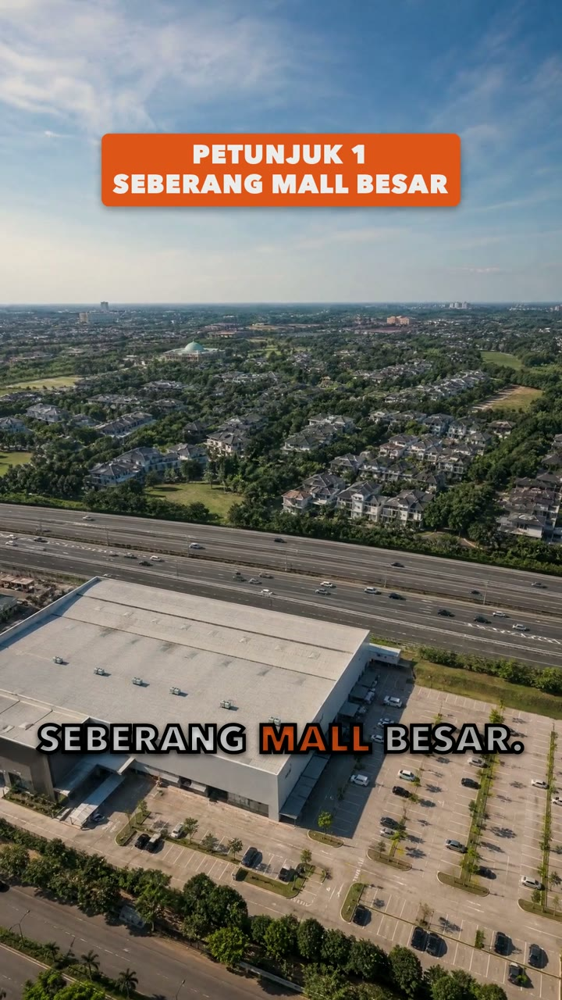

# Studi Kasus · Tebak Harga

Ini reel contoh yang dipakai di seluruh kelas. Semua nama di sini fiktif, dan semua gambar dibuat AI.

- **Klien:** Rumah Kita Realty (agen properti fiktif)
- **Produk:** Cluster Aster di Kota Harapan (kota mandiri fiktif)
- **Presenter:** Rani, orang yang dibuat AI dari nol, bukan orang asli
- **Format:** tebak harga. Janji di detik pertama, tiga petunjuk, penundaan, lalu jawaban harga dan ajakan.
- **Ukuran:** sekitar 28 detik, 9:16, 1080×1920, 30 frame per detik, kekerasan suara sekitar −14 LUFS

Penting: di proyek nyata, rumah yang dijual adalah foto asli dari klien, dan hanya kameranya yang bergerak. Di contoh ini rumahnya gambar AI, karena klien dan proyeknya fiktif.

## Tonton dulu

▶ [Contoh_Tebak_Harga_Animatic_v1.0.mp4](Contoh_Tebak_Harga_Animatic_v1.0.mp4)

Ini *animatic*: seluruh reel sebagai gambar diam, lengkap dengan caption, grafis, transisi, narasi, musik, dan efek suara. Animatic dibuat di komputer sendiri, gratis, dengan `vg edit animatic` (`vg` adalah singkatan dari `python3 2_Tools/vg/vg.py`, dijalankan dari folder kelas). Folder ini berisi animatic, bukan video final dengan klip AI yang bergerak. File-nya berdurasi 27,9 detik dan punya 837 frame (27,9 × 30).

<p>




</p>

## Isi folder ini

| File | Isinya |
|---|---|
| `1_Gambar/Rani_Portrait_Ref.jpg` | potret referensi Rani: wajah acuan untuk semua shot Rani |
| `1_Gambar/Rani_Turnaround_Ref.jpg` | lembar putar: Rani dari empat arah, supaya tubuh dan pakaiannya konsisten |
| `1_Gambar/Rani_Mobil.jpg` | S01, hook: Rani di dalam mobil |
| `1_Gambar/Rani_Boulevard.jpg` | S06: Rani di boulevard |
| `1_Gambar/Area_Aerial.jpg` | S03: foto udara dengan mall, jalan tol, dan perumahan. Juga latar kabur untuk peta di S04 |
| `1_Gambar/Rencana_MRT.jpg` | S07: render rencana stasiun MRT, selalu dengan label ILUSTRASI RENCANA |
| `1_Gambar/Look_Rumah_Deret.jpg` | gambar look: deretan rumah dua lantai (S02, S08, dan latar end card S11) |
| `1_Gambar/Look_Rumah_Depan.jpg` | gambar look: depan rumah (S05 dan S10) |
| `1_Gambar/Frame_*.jpg` | gambar diam dari animatic, lengkap dengan caption dan grafis: `Frame_hook` (S01), `Frame_rumah` (S02), `Frame_petunjuk1` (S03), `Frame_peta` (S04), `Frame_petunjuk3` (S05), `Frame_mrt` (S07), `Frame_harga` (S10), `Frame_akhir` (S11) |
| `2_Audio/Narration_Take_Callirrhoe_v1.mp3` | narasi, suara Callirrhoe |
| `2_Audio/Music_Take_Quiz_Pop_v1.mp3` | musik latar dari Lyria, take "Quiz_Pop" |
| `2_Audio/Sfx_Whoosh_v1.wav` | whoosh di bawah setiap potongan whip |
| `2_Audio/Sfx_Tap_v1.wav` | tap kecil saat judul atau callout muncul |
| `2_Audio/Sfx_Tick_v1.wav` | tick saat penghitung berjalan |
| `2_Audio/Sfx_Ding_v1.wav` | ding di jawaban harga |
| `Edit_Spec.json` | rencana edit: timing, caption, grafis, transisi, grade, narasi, musik, dan efek |
| `Narasi.txt` | naskah narasi, persis seperti dibaca oleh suara AI |
| `Shotlist.json` | blok *look* (dunia, cahaya, grade, gaya grafis), aturan klien, dan prompt dua gambar rumah AI yang dikutip di Pelajaran 03 |
| `Contoh_Tebak_Harga_Animatic_v1.0.mp4` | animatic seluruh reel |

Keempat efek suara dibuat gratis oleh `vg audio sfx`.

<p>


</p>

## Timeline

| Shot | Detik | Gambar | Teks di layar | Narasi | Transisi dan efek |
|---|---|---|---|---|---|
| S01 | 0–2,1 | Rani di mobil (hook) | TEBAK HARGANYA? | "Tebak harga rumah ini." | tap |
| S02 | 2,1–3,55 | deretan rumah | RUMAH 2 LANTAI | "Tiga petunjuk." | potong keras, tap |
| S03 | 3,55–6,3 | foto udara | PETUNJUK 1 / SEBERANG MALL BESAR | "Petunjuk satu: seberang mall besar." | whip + whoosh, tap |
| S04 | 6,3–9,05 | peta di atas foto udara yang dikaburkan | PETUNJUK 2, ± 2 KM KE TOL, "Peta ilustrasi, tidak berskala." | "Dua: cuma dua kilo ke tol." | whip + whoosh, tap |
| S05 | 9,05–14,2 | depan rumah | PETUNJUK 3, callout SMART LOCK, SOLAR WATER HEATER, 3 TITIK CCTV | "Tiga: udah ada smart lock, solar water heater, sama CCTV." | potong keras, tap per callout |
| S06 | 14,2–15,5 | Rani di boulevard | UDAH KETEBAK? | "Udah ketebak?" | potong keras, tap |
| S07 | 15,5–18,45 | render rencana stasiun MRT | ILUSTRASI RENCANA, BONUS / RENCANA STASIUN MRT | "Bonus: ada rencana stasiun MRT." | whip + whoosh |
| S08 | 18,45–20,45 | deretan rumah | penghitung sampai 1.000, UNIT TERJUAL | "Seribu unit udah laku." | potong keras, tick |
| S09 | 20,45–21,75 | Rani | (caption saja) | "Harganya..." | potong keras |
| S10 | 21,75–23,9 | depan rumah | MULAI 1,3M-AN*, "*S&K berlaku, dapat berubah." | "mulai satu koma tiga M-an!" | flash putih + ding + drop musik |
| S09B | 23,9–25,0 | Rani | (caption saja) | "Mau lihat langsung?" | potong keras |
| S11 | 25,0–27,8 | end card | RUMAH KITA REALTY, CLUSTER ASTER · KOTA HARAPAN, DM UNTUK PROMO TERBARU, 0812-0000-0000 | "DM Rumah Kita Realty." | whoosh pelan; berakhir saat musik berhenti |

Perhatikan pola transisinya. Potong keras hampir di semua tempat. Whip hanya saat tempatnya berganti. Flash hanya sekali, di jawaban harga. Semua gambar memakai satu grade yang sama, dan caption muncul kata demi kata.

## Narasi

Satu suara untuk seluruh reel, sebagai voice-over. Rani tidak bicara di layar; semua kata datang dari narasi. Suaranya Callirrhoe, dibuat dengan `google/gemini-3.8-flash-lite-tts` lewat OpenRouter, sekitar US$0,003 per take 20 detik.

> Tebak harga rumah ini. Tiga petunjuk. Petunjuk satu: seberang mall besar. Dua: cuma dua kilo ke tol. Tiga: udah ada smart lock, solar water heater, sama CCTV. Udah ketebak? Bonus: ada rencana stasiun MRT. Seribu unit udah laku. Harganya... mulai satu koma tiga M-an! Mau lihat langsung? DM Rumah Kita Realty.

Di `Narasi.txt`, angka ditulis sebagai kata ("satu koma tiga M-an"), karena suara AI membaca teks persis seperti tertulis. Di `Edit_Spec.json`, teks narasinya memakai angka ("1,3M-an"), karena teks itulah yang menjadi caption. Tanda titik, koma, titik dua, tanda tanya, dan "..." juga penting: caption selalu berhenti di tanda jeda, jadi "Harganya..." tampil sendiri dan harganya baru muncul saat diucapkan.

## Musik dan drop

Musiknya take "Quiz_Pop" dari Lyria (`google/lyria-3-clip-preview` lewat OpenRouter, sekitar US$0,04 per klip 30 detik). *Drop* musik, bagian yang paling bertenaga, harus jatuh tepat saat harga disebut.

1. `vg audio curve` membaca kekerasan lagu dari waktu ke waktu dan mencari drop-nya. Drop "Quiz_Pop" ada di detik **18,5** lagu.
2. Harga disebut di detik **21,8** reel, di kata "mulai", bersama flash putih dan ding.
3. Waktu mulai musik = waktu harga di reel − waktu drop di lagu. Di rencana edit tertulis `music.at = 3.27`: musik masuk di detik 3,27 reel, dan drop-nya jatuh di 3,27 + 18,5 ≈ 21,8 detik.

Perintahnya dijalankan dari folder kelas. File musiknya harus ada di dalam folder proyek:

```bash
python3 2_Tools/vg/vg.py audio curve -p NAMA_PROYEK --file 6_Edit/1_Audio/Music_Take_Quiz_Pop_v1.mp3
```

Di bawah narasi, musiknya dikecilkan (`volume` 0,3, `duck` 0,5). Reel berakhir tepat saat musiknya berhenti, bukan memudar ke keheningan. Catatan jujur: pencarian drop ini sempat salah dua kali sebelum menemukan detik 18,5. Ceritanya ada di Pelajaran 13.

## `Edit_Spec.json` dan path filenya

`Edit_Spec.json` disalin dari proyek aslinya. Karena itu path di dalamnya masih menunjuk ke folder proyek asli (`file:2_References/...` dan `file:6_Edit/1_Audio/...`), dan nama filenya sedikit berbeda (gambar berakhiran `_v1.png`, narasi `.wav`). Di folder ini, file yang sama bernama:

| Di `Edit_Spec.json` | Di folder ini |
|---|---|
| `file:2_References/Rani_Mobil_v1.png` | `1_Gambar/Rani_Mobil.jpg` |
| `file:2_References/Look_Rumah_Deret_v1.png` | `1_Gambar/Look_Rumah_Deret.jpg` |
| `file:2_References/Area_Aerial_v1.png` | `1_Gambar/Area_Aerial.jpg` |
| `file:2_References/Look_Rumah_Depan_v1.png` | `1_Gambar/Look_Rumah_Depan.jpg` |
| `file:2_References/Rani_Boulevard_v1.png` | `1_Gambar/Rani_Boulevard.jpg` |
| `file:2_References/Rencana_MRT_v1.png` | `1_Gambar/Rencana_MRT.jpg` |
| `file:2_References/Rani_Cta_v1.png` (S09 dan S09B) | `1_Gambar/Rani_Cta.jpg` |
| `file:6_Edit/1_Audio/Narration_Take_Callirrhoe_v1.wav` | `2_Audio/Narration_Take_Callirrhoe_v1.mp3` (di sini dalam format mp3) |
| `file:6_Edit/1_Audio/Music_Take_Quiz_Pop_v1.mp3` | `2_Audio/Music_Take_Quiz_Pop_v1.mp3` |
| `file:6_Edit/1_Audio/Sfx_Whoosh_v1.wav`, `Sfx_Tap_v1.wav`, `Sfx_Tick_v1.wav`, `Sfx_Ding_v1.wav` | `2_Audio/` dengan nama yang sama |

Beberapa hal lain yang perlu kamu tahu saat membaca file ini:

- `output` berisi `Contoh_Tebak_Harga_v1.0.mp4`: nama yang akan dipakai `vg edit final` di `99_Output/`.
- Waktu grafis dihitung dalam detik **dari awal segmennya**, bukan dari awal reel.
- Semua segmen di sini berupa gambar diam (`still` atau `background`), karena ini rencana animatic kelas. Di proyek dengan klip AI, shot AI ditulis sebagai segmen klip (`"clip": "S01"` dengan `"fallback": "still"`). Animatic lalu menampilkan frame pertamanya, dan edit final memakai klipnya.

## Biaya reel ini

| Bagian | Biaya |
|---|---|
| Gambar (gpt-image-2, 10 kredit per gambar 2K) | sekitar 70 kredit |
| Video (Veo 3.1 Lite, 35 kredit per klip 8 detik di 1080p) | 7 klip × 35 = 245 kredit: pilot 35, lalu 6 klip 210 |
| Narasi dan musik (OpenRouter) | di bawah US$0,50 |

Gambar tidak butuh persetujuan biaya, tapi look tetap disetujui dulu di Gerbang 1. Video selalu lewat Gerbang 3 dan dimulai dari satu klip pilot.

## Yang salah di versi pertama

Versi pertama reel ini dinilai jelek. Setiap shot punya cahaya dan grade sendiri. Janji di hook tidak ditepati. Suara TTS ditempel di atas bibir AI, dan suara ruangannya dimatikan sampai hening.

Perbaikannya sekarang menjadi aturan kelas: look disetujui dulu dan seluruh reel ditonton sebagai gambar sebelum video, shot list mencatat `promise` dan `pays_off`, narasi voice-over dengan mulut tertutup, dan audio dibuat dulu. Saat memeriksa, kami juga menemukan tiga bug: caption yang menampilkan harga sebelum diucapkan, animatic yang membeku sekitar 2,5 detik, dan pencarian drop musik yang dua kali memilih momen yang salah.

Cerita lengkapnya: [Pelajaran 13 · Kesalahan yang Kami Buat](../../1_Pelajaran/Pelajaran_13_Kesalahan_Yang_Kami_Buat_v1.1.md)

## Bahan lain

- Deck kelas: [Kelas_AI_Videographer_Deck_v1.6.pdf](../../4_Deck/Kelas_AI_Videographer_Deck_v1.6.pdf)
- Mulai kelas dari awal: [Pelajaran 00 · Mulai di Sini](../../1_Pelajaran/Pelajaran_00_Mulai_Di_Sini_v1.2.md)
