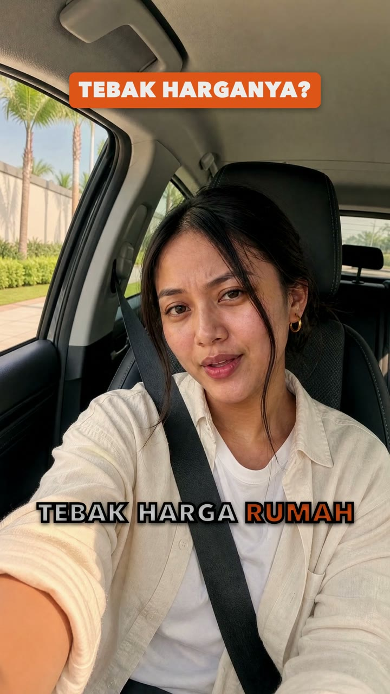
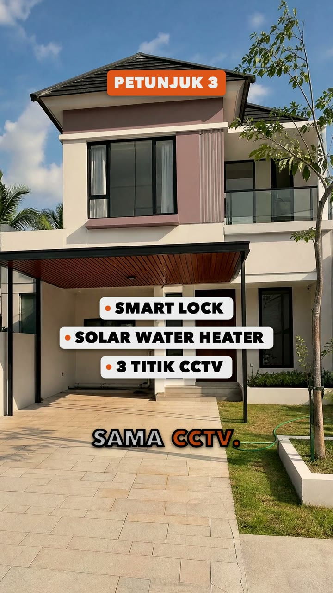
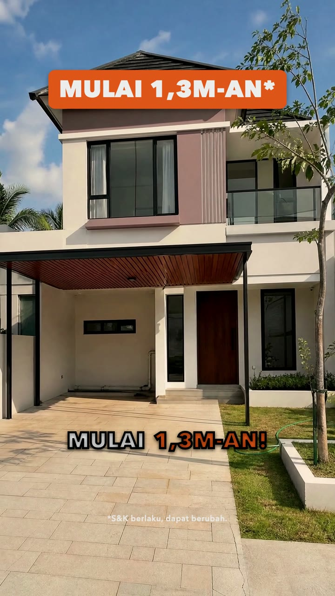

# Kelas AI Videographer

**Dari brief ke reel, dengan AI.** Dasar AI dan praktik membuat video properti 9:16, langkah demi langkah, untuk kamu yang baru mulai.

## Apa ini

Di kelas ini kamu belajar dua hal. Pertama, dasar AI: apa itu AI, cara ia belajar, dan kenapa ia menebak, bukan tahu. Kedua, praktik: membuat satu reel properti dari brief sampai video, dengan bantuan agent AI.

Kamu tidak perlu hafal perintah. Kamu bicara ke *agent* (AI yang bisa membaca file dan menjalankan alat untukmu) dengan bahasa biasa. Di workshop, agent-nya WorkBuddy dengan *Expert* AI Videographer dan model cepat glm-5.3-flash. Claude Code juga bisa dipakai, dengan cara yang sama. Misalnya: "Buat reel dari brief di 5_Projects/.../0_Source". Di WorkBuddy cukup klik **Buat video baru** dan jawab lima pertanyaan tentang produkmu. Agent membaca *skill* (file instruksi cara kerja kita) di `1_Skills/`, lalu menjalankan alat vg. Tugasmu memutuskan dan menyetujui.

Semua contoh di kelas ini memakai satu reel: **Tebak Harga**. Kliennya Rumah Kita Realty, agen properti fiktif. Produknya Cluster Aster di Kota Harapan, kota fiktif. Presenternya Rani, orang yang dibuat AI dari nol, bukan orang asli. Semua gambar di kelas ini dibuat AI.

## Pengajar

Hai, aku **Andre Tansil**, AI Specialist dan AI Automation Builder. Lebih dari 8 tahun aku bekerja di software, business analysis, dan product: mulai sebagai developer, lalu memimpin tim engineering, lalu menjadi product manager. Sekarang aku Senior Business Analyst di ROOTCLOUD dan Community Lead [AICLUB.ID](https://aiclub.id) Tangerang Selatan. Aku lulusan Teknik Telekomunikasi ITB dan S2 di Seoul National University of Science and Technology, tempat aku meriset machine learning. AI Videographer, alat di kelas ini, aku bangun sendiri untuk membuat reel properti dengan AI.

[LinkedIn](https://www.linkedin.com/in/andretansil) · [Instagram @andretansil](https://www.instagram.com/andretansil/)

 

## Untuk siapa

- Untuk pemula total. Kamu belum pernah memakai *terminal* (jendela tempat mengetik perintah ke komputer) atau *coding agent*? Tidak apa-apa. Kita mulai dari nol.
- Bagian 1 bisa dibaca tanpa komputer.
- Untuk Bagian 2 kamu butuh laptop Windows (10 atau 11) atau Mac, internet, dan sedikit saldo di [kie.ai](https://kie.ai) (gambar dan video) dan [OpenRouter](https://openrouter.ai) (suara dan musik). Otak agent di WorkBuddy, model glm-5.3-flash, sudah ada di dalam WorkBuddy dan memakai kredit WorkBuddy-mu, jadi tidak perlu akun lain.

## Mulai cepat: tiga langkah

1. **Pasang WorkBuddy** dari https://www.workbuddy.ai, masuk dengan Google atau GitHub, lalu pilih model **glm-5.3-flash**.
2. **Minta AI-nya memasang.** Di WorkBuddy, pilih folder kerja dan kirim satu pesan dari [Panduan WorkBuddy](5_WorkBuddy/Panduan_WorkBuddy_v1.2.md). AI-nya mengunduh folder kelas dan menjalankan `setup.ps1` (Windows) atau `bash setup.sh` (Mac). Kamu hanya mengklik izinkan; di Mac juga mengklik Install kalau jendela Apple muncul, dan menempel satu baris di Terminal kalau Homebrew belum ada.
3. **Tempel kunci, lalu buka ulang.** Di halaman **Setup AI Videographer** yang terbuka di browser, tempel kunci kie.ai dan OpenRouter, lalu klik **Simpan**. Kunci tidak pernah ditempel ke chat. Tutup WorkBuddy (Cmd + Q), buka lagi, buka folder yang disebut di akhir setup, dan pilih Expert **AI Videographer**.

Setelah itu klik **Buat video baru**. Expert menanyakan lima hal tentang produkmu, lalu bekerja sendiri dan hanya berhenti di tiga gerbang, tempat kamu mengklik di halaman review. Langkah lengkapnya, termasuk cara memakai Claude Code, ada di [Pelajaran 04](1_Pelajaran/Pelajaran_04_Persiapan_Alat_v1.2.md).

## Yang akan kamu buat

Satu reel properti vertikal 9:16, sekitar 28 detik: 1080×1920 piksel, 30 frame per detik, kekerasan suara sekitar −14 LUFS. Isinya narasi dan musik, caption yang menyala per kata, judul, peta dan transisi, serta klip AI yang bergerak.

Tonton dulu [animatic reel contoh](2_Studi_Kasus/Tebak_Harga/Contoh_Tebak_Harga_Animatic_v1.0.mp4): seluruh reel dalam bentuk gambar diam, lengkap dengan suara, caption dan grafis.

Di reel contoh, rumahnya gambar AI karena klien dan proyeknya fiktif. Di proyek nyata, rumah yang dijual selalu foto asli dari klien, dan hanya kameranya yang bergerak.

## Berapa lama

| Bagian | Waktu baca |
|---|---|
| Pelajaran 00 | sekitar 12 menit |
| Bagian 1, teori (Pelajaran 01–03) | sekitar 30 menit |
| Bagian 2, praktik (Pelajaran 04–13) | sekitar 1 jam 45 menit |
| Studi kasus, brief latihan, dan checklist | sekitar 30 menit |

Waktu baca dihitung dari jumlah kata, dengan kecepatan baca santai sekitar 150 kata per menit. Latihan kecil di setiap pelajaran, instalasi di Pelajaran 04, dan brief latihan butuh waktu tambahan. Waktu itu belum kami ukur, karena tergantung komputermu, internetmu, dan berapa kali kamu mengulang di gerbang.

Satu saran: jangan buru-buru di gerbang. Persetujuan yang tergesa-gesa adalah cara paling cepat membuang kredit.

## Dua bagian

**Bagian 1 · Dasar AI (Pelajaran 01–03).** Apa itu AI dan cara ia belajar, model gambar, video, suara dan agent, lalu cara berpikir saat bekerja dengan AI: prompt, batas, dan etika. Kalau kamu paham cara kerjanya, kamu tahu cara memintanya, dan kapan harus curiga pada hasilnya.

**Bagian 2 · Praktik (Pelajaran 04–13).** Persiapan alat, cara kerja AI Videographer, tujuh tahap dari brief ke reel, dan kesalahan yang kami buat. Alurnya tujuh tahap dengan tiga gerbang:

| Tahap | Pelajaran | Gerbang |
|---|---|---|
| 1 · Brief dan shot list | 06 | |
| 2 · Look | 07 | **Gerbang 1** · klik *Approve look* di halaman review |
| 3 · Karakter dan frame | 08 | |
| 4 · Audio | 09 | |
| 5 · Animatic | 10 | **Gerbang 2** · klik *Approve reel* di halaman review |
| 6 · Video | 11 | **Gerbang 3** · klik *Approve · N credits* per klip di bagian Video, lalu konfirmasi |
| 7 · Edit final | 12 | |

Di setiap gerbang alat berhenti sampai kamu setuju. Di kelas ini kita memakai `VG_APPROVAL_MODE=page`: ketiga gerbang adalah klikmu di halaman review (`vg review`). Perintah `vg approve` selalu ditolak di mode ini, jadi agent tidak bisa menyetujui untukmu. Cara lain, mode `terminal`: kamu mengetik kode acak 4 digit di terminalmu sendiri.

## Semua pelajaran

Kerjakan berurutan. Setiap pelajaran memakai yang sebelumnya.

| No | Pelajaran | Yang kamu pelajari | Waktu baca |
|---|---|---|---|
| 00 | [Mulai di Sini](1_Pelajaran/Pelajaran_00_Mulai_Di_Sini_v1.2.md) | isi kelas dan peta bahan, aturan emas, enam aturan keselamatan, biaya satu reel | ±12 menit |
| 01 | [Apa Itu AI dan Cara Ia Belajar](1_Pelajaran/Pelajaran_01_Apa_Itu_AI_v1.1.md) | beda program biasa dan AI, empat langkah AI belajar, halusinasi, fakta yang wajib dicek manusia | ±8 menit |
| 02 | [Model Gambar, Video, Suara, dan Agent](1_Pelajaran/Pelajaran_02_Model_Dan_Agent_v1.1.md) | lima model dan tugasnya, kenapa teks dan jari sering salah, kenapa klip pendek, apa itu agent | ±11 menit |
| 03 | [Cara Berpikir dengan AI: Prompt, Batas, dan Etika](1_Pelajaran/Pelajaran_03_Cara_Berpikir_Dengan_AI_v1.1.md) | enam prinsip kerja, prompt lima bagian, batas AI dan cara mengakalinya, lima aturan etika | ±10 menit |
| 04 | [Persiapan Alat](1_Pelajaran/Pelajaran_04_Persiapan_Alat_v1.2.md) | memakai Terminal, WorkBuddy memasang semuanya dengan `bash setup.sh` (atau memasang sendiri untuk Claude Code), halaman setup untuk kunci API dan `VG_APPROVAL_MODE=page`, `vg doctor` sampai nol FAIL | ±16 menit, plus instalasi |
| 05 | [Cara Kerja AI Videographer](1_Pelajaran/Pelajaran_05_Cara_Kerja_Harness_v1.2.md) | tiga pemain, `vg next`, tujuh tahap dan tiga gerbang, folder proyek dan nama file, kredit dan batas biaya | ±13 menit |
| 06 | [Dari Brief ke Shot List](1_Pelajaran/Pelajaran_06_Brief_Ke_Shot_List_v1.1.md) | membaca brief, beat dulu baru shot, janji hook (`promise` dan `pays_off`), `vg validate` | ±10 menit |
| 07 | [Look: Satu Dunia Visual, dan Halaman Review](1_Pelajaran/Pelajaran_07_Look_Dan_Review_v1.1.md) | satu look untuk seluruh reel, style frame, halaman review, Gerbang 1 dengan satu klik | ±10 menit |
| 08 | [Karakter, Storyboard, dan Frame](1_Pelajaran/Pelajaran_08_Karakter_Storyboard_Frame_v1.1.md) | lembar referensi Rani, panel di awal aksi, frame pertama dan terakhir, cek kesinambungan | ±9 menit |
| 09 | [Audio Dulu](1_Pelajaran/Pelajaran_09_Audio_Dulu_v1.2.md) | narasi voice-over, memilih suara dengan telinga, musik dan `music.at`, efek suara | ±10 menit |
| 10 | [Rencana Edit dan Animatic](1_Pelajaran/Pelajaran_10_Edit_Plan_Dan_Animatic_v1.1.md) | `Edit_Spec.json`, transisi yang punya alasan, menonton animatic, Gerbang 2 | ±9 menit |
| 11 | [Prompt Video dan Gerbang Biaya](1_Pelajaran/Pelajaran_11_Video_Dan_Gerbang_Biaya_v1.1.md) | prompt yang hanya menjelaskan gerak, estimasi biaya, bagian Video dan Gerbang 3, klip pilot, `vg resume` | ±11 menit |
| 12 | [Edit Final dan Kirim](1_Pelajaran/Pelajaran_12_Edit_Final_Dan_Kirim_v1.1.md) | draft dan versi final, daftar cek sebelum kirim, versi tanpa menimpa | ±7 menit |
| 13 | [Kesalahan yang Kami Buat](1_Pelajaran/Pelajaran_13_Kesalahan_Yang_Kami_Buat_v1.1.md) | kenapa versi pertama gagal, aturan yang lahir darinya, tiga bug yang ditemukan dengan memeriksa | ±7 menit |

Setiap pelajaran punya bentuk yang sama: Tujuan, Kenapa ini penting, isi, Latihan kecil, Cek pemahaman, dan Ringkasan. Jawab Cek pemahaman dulu, baru buka jawabannya.

Ketemu istilah yang belum kamu pahami? Cari di [Glosarium](Glosarium_v1.2.md).

## Studi kasus: Tebak Harga

[Studi Kasus · Tebak Harga](2_Studi_Kasus/Tebak_Harga/README.md) berisi semua bahan reel contoh:

- gambar AI di `1_Gambar/`: potret dan lembar putar Rani, style frame rumah, foto udara, rencana stasiun MRT, dan frame dari animatic;
- audio di `2_Audio/`: narasi suara Callirrhoe, musik "Quiz_Pop", dan empat efek suara;
- rencana edit (`Edit_Spec.json`), naskah narasi (`Narasi.txt`), dan animatic seluruh reel;
- timeline per shot, cara menaruh drop musik, biaya, dan cerita jujur tentang versi pertama yang gagal.

Biaya nyata reel ini: gambar sekitar 70 kredit, video 7 klip × 35 = 245 kredit (pilot 35, lalu 6 klip 210), suara dan musik di bawah US$0,50.

## Latihan

Setelah Pelajaran 13, buat reelmu sendiri:

- **[Brief Latihan · Rumah Melati, 3 Alasan](3_Latihan/Brief_Latihan_v1.2.md)**: brief fiktif untuk latihan pertamamu dari awal sampai akhir.
- **[Checklist per Tahap](3_Latihan/Checklist_Per_Tahap_v1.2.md)**: centang semua kotak sebelum pindah tahap.

## Workshop dengan WorkBuddy

Di workshop, agent-nya WorkBuddy, aplikasi agent desktop dari Tencent. Expert AI Videographer selalu bertanya ke alat dulu dengan `vg next`, lalu mengerjakan satu langkah itu saja. Karena itu model yang cepat dan murah, glm-5.3-flash, cukup untuk menjadi otaknya.

- **[Panduan WorkBuddy](5_WorkBuddy/Panduan_WorkBuddy_v1.2.md)**: memasang dalam tiga langkah, lalu membuat satu reel dengan Expert AI Videographer.
- **[Runsheet Workshop](5_WorkBuddy/Runsheet_Workshop_v1.1.md)**: susunan acara untuk fasilitator.

## Deck

Slide kelas, urutan dan isinya sama dengan pelajaran:

- [Kelas_AI_Videographer_Deck_v1.4.pptx](4_Deck/Kelas_AI_Videographer_Deck_v1.4.pptx) (PowerPoint)
- [Kelas_AI_Videographer_Deck_v1.4.pdf](4_Deck/Kelas_AI_Videographer_Deck_v1.4.pdf) (PDF)

## Satu hal untuk diingat

Gambar dulu. Suara dulu. Gerak terakhir.

Berikutnya: [Pelajaran 00 · Mulai di Sini](1_Pelajaran/Pelajaran_00_Mulai_Di_Sini_v1.2.md)
