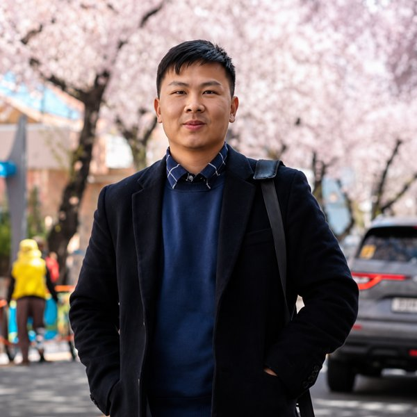

# AI Videographer · Kelas

Repo ini berisi dua hal sekaligus: AI Videographer, sebuah *harness* (kumpulan instruksi dan alat yang membuat agent AI bekerja dengan urutan yang sama setiap kali), dan kelas pemula berbahasa Indonesia untuk memakainya. Kamu bicara ke agent dengan bahasa biasa, misalnya "Buat reel dari brief ini". Di workshop, agent-nya WorkBuddy dengan *Expert* (agent dengan uraian tugas khusus) bernama AI Videographer. Claude Code juga bisa dipakai, dengan cara yang sama. Agent mengikuti *skill* (file instruksi cara kerja) di `1_Skills/`, lalu menjalankan alat vg untuk membuat gambar, suara, dan video. Hasilnya reel properti vertikal 9:16. Aturan emasnya: gambar itu murah, video itu mahal. Jadi seluruh reel disetujui sebagai gambar dulu, dan video hanya dibuat setelah kamu bilang "ya".

## Mulai di sini

- **[Kelas AI Videographer](6_Kelas/README.md)**: daftar semua pelajaran, studi kasus, latihan, dan deck.
- **[Pelajaran 00 · Mulai di Sini](6_Kelas/1_Pelajaran/Pelajaran_00_Mulai_Di_Sini_v1.2.md)**: pelajaran pertama. Belum pernah memakai terminal? Mulai dari sini.
- **[Panduan WorkBuddy](6_Kelas/5_WorkBuddy/Panduan_WorkBuddy_v1.1.md)**: memasang dalam tiga langkah dan memakai WorkBuddy dengan Expert AI Videographer, agent untuk workshop.

## Pengajar



Hai, aku **Andre Tansil**, AI Specialist dan AI Automation Builder. Lebih dari 8 tahun aku bekerja di software, business analysis, dan product: mulai sebagai developer, lalu memimpin tim engineering, lalu menjadi product manager. Sekarang aku Senior Business Analyst di ROOTCLOUD dan Community Lead [AICLUB.ID](https://aiclub.id) Tangerang Selatan. Aku lulusan Teknik Telekomunikasi ITB dan S2 di Seoul National University of Science and Technology, tempat aku meriset machine learning. AI Videographer, alat di kelas ini, aku bangun sendiri untuk membuat reel properti dengan AI.

[LinkedIn](https://www.linkedin.com/in/andretansil) · [Instagram @andretansil](https://www.instagram.com/andretansil/)

<br clear="left">

## Peta folder

| Folder | Isi |
|---|---|
| `1_Skills/` | skill untuk agent, file instruksi tahap demi tahap. Titik mulainya `1_Skills/vg-director/SKILL.md`. |
| `2_Tools/` | alat vg, program Python kecil yang memanggil model, mencatat biaya, dan menolak video yang belum disetujui. Pemasang Expert WorkBuddy ada di `2_Tools/workbuddy/`. |
| `3_Templates/` | templat folder proyek (`0_Source` sampai `99_Output`) |
| `4_Docs/` | dokumen desain dan catatan teknis harness |
| `5_Projects/` | proyek videomu, satu folder per video. Isinya tidak ikut diunggah ke GitHub. |
| `6_Kelas/` | kelasnya: pelajaran, studi kasus Tebak Harga, brief latihan, checklist, deck, dan panduan WorkBuddy |
| `99_Output/` | hasil akhir yang siap dikirim. Isinya juga tidak ikut diunggah ke GitHub. |

## Persiapan cepat: tiga langkah

Yang kamu butuhkan: sebuah Mac, akun [kie.ai](https://kie.ai) untuk gambar dan video, dan akun [OpenRouter](https://openrouter.ai) untuk suara dan musik (boleh menyusul). Otak agent di WorkBuddy, model glm-5.3-flash, sudah ada di dalam WorkBuddy dan memakai kredit WorkBuddy-mu. Tidak perlu akun lain.

1. **Pasang WorkBuddy** dari https://www.workbuddy.ai, masuk dengan Google atau GitHub, lalu pilih model **glm-5.3-flash**.
2. **Minta AI-nya memasang.** Di WorkBuddy, pilih folder kerja dan kirim satu pesan dari [Panduan WorkBuddy](6_Kelas/5_WorkBuddy/Panduan_WorkBuddy_v1.1.md). AI-nya mengunduh repo ini dan menjalankan `bash setup.sh`, yang memeriksa Xcode Command Line Tools dan Python, memasang FFmpeg, menghubungkan skill, dan memasang Expert AI Videographer. Kamu hanya mengklik izinkan, mengklik Install kalau jendela Apple muncul, dan menempel satu baris di app Terminal kalau Homebrew belum ada.
3. **Tempel kunci, lalu buka ulang.** Halaman **Setup AI Videographer** terbuka di browser. Tempel kunci kie.ai dan OpenRouter di sana, **bukan di chat**, lalu klik **Simpan**. Halaman itu mengecek saldo kie.ai-mu dan mengatur persetujuan menjadi klik di halaman review (`VG_APPROVAL_MODE=page`). Tutup WorkBuddy (Cmd + Q), buka lagi, buka folder yang disebut di akhir setup, dan pilih Expert **AI Videographer**.

Lalu klik **Buat video baru**. Expert menanyakan lima hal tentang produkmu, bekerja sendiri, dan hanya berhenti di tiga gerbang: *Approve look*, *Approve reel*, dan *Approve* untuk satu klip pilot di bagian Video. Setelah setiap klik, bilang "sudah" di WorkBuddy.

**Tanpa WorkBuddy (misalnya Claude Code):** pasang Xcode Command Line Tools, Homebrew, FFmpeg, Git, dan Python 3.9 atau lebih baru dengan mengikuti [Pelajaran 04 · Persiapan Alat](6_Kelas/1_Pelajaran/Pelajaran_04_Persiapan_Alat_v1.2.md), lalu jalankan di Terminal, satu baris sekali:

```bash
git clone https://github.com/tansilandre/ai-videographer-kelas.git
cd ai-videographer-kelas
bash install.sh
python3 2_Tools/vg/vg.py setup
python3 2_Tools/vg/vg.py doctor
```

`vg setup` membuka halaman setup yang sama untuk kuncimu. Cara lain: isi kunci di file `.env` sendiri, dan ubah `VG_APPROVAL_MODE=terminal` menjadi `VG_APPROVAL_MODE=page`. Jalankan baris terakhir lagi sampai tidak ada baris `FAIL`. Tidak ada perintah bernama `vg` di komputermu. Tulisan `vg doctor` di kelas ini adalah singkatan dari `python3 2_Tools/vg/vg.py doctor`.

Kredit WorkBuddy habis? Ada cadangan yang tidak wajib: gateway milikmu sendiri, misalnya SumoPod, dipasang dengan `bash 2_Tools/workbuddy/install_workbuddy.sh --add-models`.

## Aturan keselamatan

- **Hanya kamu yang mengisi `.env`, lewat halaman setup atau dengan tangan, dan API key tidak pernah ditempel ke chat.** Agent hanya boleh memeriksa `.env` lewat `vg doctor`. Buat kunci kie.ai khusus di https://kie.ai/api-key dan beri batas kredit total.
- **Tidak ada video tanpa "ya" yang jelas darimu.** Dengan `VG_APPROVAL_MODE=page` (disarankan untuk kelas), ketiga gerbang adalah klikmu di halaman review. Untuk video, setiap klip menunjukkan biayanya, dan halaman bertanya sekali lagi sebelum menyetujui. Perintah `vg approve` selalu ditolak di mode ini, jadi agent tidak bisa menyetujui untukmu. Cara lain, mode `terminal`: kamu mengetik kode acak 4 digit di terminalmu sendiri.
- **Mulai dari satu klip pilot.** Setiap persetujuan membayar tepat satu *take* (satu kali percobaan). Mengulang klip, termasuk klip yang gagal, butuh persetujuan baru.
- **Tugas yang *timeout* (waktu tunggunya habis) diambil dengan `vg resume`**, tidak pernah dikirim ulang. Mengirim ulang bisa membayar dua kali.

## In English

This repository is the AI Videographer harness plus a beginner class taught in Bahasa Indonesia. The harness is a set of agent skills and a small Python CLI that turns a client brief into a 9:16 short-form video, and it refuses to spend video credits until a human has approved the look, the whole reel as stills, and the per-clip cost. The class, in `6_Kelas/`, walks through one example reel from brief to final edit. The workshop runs the harness in WorkBuddy with the AI Videographer Expert and glm-5.3-flash, a fast model that is built into WorkBuddy and follows `vg next` one step at a time; Claude Code works the same way.

Taught by **Andre Tansil**, AI Specialist and AI Automation Builder: 8+ years across software engineering, business analysis and product; Senior Business Analyst at ROOTCLOUD; Community Lead of AICLUB.ID Tangerang Selatan; M.S. from Seoul National University of Science and Technology. [LinkedIn](https://www.linkedin.com/in/andretansil)

Setup takes three steps. (1) Install WorkBuddy, sign in with Google or GitHub, and pick glm-5.3-flash. (2) In WorkBuddy, pick a work folder and send the one message from the [WorkBuddy guide](6_Kelas/5_WorkBuddy/Panduan_WorkBuddy_v1.1.md): its AI clones this repository and runs `bash setup.sh`, which checks the Xcode Command Line Tools and Python, installs FFmpeg with Homebrew, links the skills and installs the Expert (it is safe to run again). (3) Paste your kie.ai and OpenRouter keys into the local Setup AI Videographer page that opens (`python3 2_Tools/vg/vg.py setup`), never into the chat, and click Simpan; then quit and reopen WorkBuddy, open the folder setup printed, and pick the AI Videographer Expert. Its quick prompt "Buat video baru" asks five questions about the product and then works on its own until one of the three gates. Without WorkBuddy, run `bash install.sh`, then `python3 2_Tools/vg/vg.py setup`, or edit `.env` by hand. The model needs no gateway or extra account; an OpenAI-compatible gateway such as SumoPod (`bash 2_Tools/workbuddy/install_workbuddy.sh --add-models`) is only an optional fallback when WorkBuddy credits run out.

The setup page sets `VG_APPROVAL_MODE=page`, so every approval is a click on the local review page, and `vg approve` on the command line always refuses. The original English overview of the harness is in [4_Docs/Harness_Overview_EN.md](4_Docs/Harness_Overview_EN.md).
